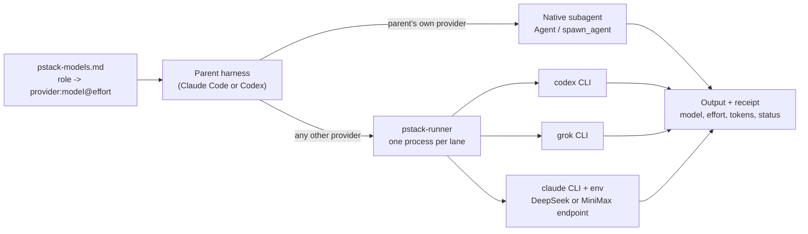

# pstack-flex

[](https://github.com/thisguymartin/pstack-flex/actions/workflows/ci.yml)
[](https://github.com/ericlitman/open-pstack/releases/tag/v1.5.0)
[](LICENSE)

**pstack-flex runs [Lauren Tan (@poteto)](https://x.com/poteto)'s [pstack](https://github.com/cursor/plugins/tree/main/pstack) in Claude Code and Codex on the models you actually have.** It is a fork of [ericlitman/open-pstack](https://github.com/ericlitman/open-pstack), which translates pstack's Cursor-specific parts for Claude Code and Codex. open-pstack assumes four frontier subscriptions. This fork keeps its skills and workflows and changes one thing: which models setup accepts and how they are reached.

Lauren built pstack from the skills she uses to ship code at Cursor. In a [55-minute interview with Denis Labelle](https://x.com/DenisLabelle/status/2091337807939706928), she says that she shipped 1,000 pull requests in one month after steadily improving how her agents work and verify their results.

> If you want to go fast, go deep first.

If Cursor is your main coding environment, use [Lauren's original pstack](https://github.com/cursor/plugins/tree/main/pstack). If you hold all four subscriptions and want the closest translation, use [open-pstack](https://github.com/ericlitman/open-pstack). If you want to pick your own models, pay per token where it makes sense, or run with no subscription at all, use this repository.

## What pstack does

pstack is a plugin for coding agents. It is not a new model or a hosted service. It gives your agent engineering rules, step-by-step workflows for different kinds of work, focused skills, and small local tools.

The normal entry point is `poteto-mode`. You give it a task in plain language. It then:

- reads the task and chooses a workflow that fits;
- learns how the current system works before changing it;
- compares designs when the choice matters;
- favors small, simple changes over extra machinery;
- asks several models to challenge important decisions when useful;
- runs the code and checks real behavior instead of stopping at "the tests pass"; and
- carries the work through review, continuous integration (CI), and a ready-to-merge pull request when asked.


pstack does not ask you to trust an agent on day one. It helps the agent leave evidence you can inspect. Start with supervised work. Let it run more work in parallel only after its checks have earned that trust in your own repositories.

## The models

Every pstack role (who writes code, who explores, who sits on a review panel) maps to one family. A family is one `(provider, model)` pair with its own requested effort and its own live probe in setup. These are the families pstack-flex ships:

| Family | Descriptor at default effort | Needs | First-run role |
| --- | --- | --- | --- |
| `fable` | `claude:fable@max` | Claude Code login | judgment, prose, explanation, hardest tasks, panels |
| `opus` | `claude:opus@max` | Claude Code login | panels |
| `astra` | `codex:gpt-6-astra@high` | Codex (ChatGPT) login | panels |
| `sol-6` | `codex:gpt-6-sol@high` | Codex (ChatGPT) login | feature, refactoring, bug-fix, perf-issue, hillclimb |
| `luna` | `codex:gpt-6-luna@high` | Codex (ChatGPT) login | how explorer, swarm workers |
| `sol` | `codex:gpt-5.6-sol@max` | Codex (ChatGPT) login | none; selectable |
| `grok` | `grok:grok-4.7@xhigh` | Grok CLI login | panels |
| `deepseek` | `deepseek:deepseek-flash@high` | `DEEPSEEK_API_KEY` | none; selectable |
| `deepseek-pro` | `deepseek:deepseek-v4-pro@high` | `DEEPSEEK_API_KEY` | none; selectable |
| `minimax` | `minimax:MiniMax-M3@high` | `MINIMAX_API_KEY` | none; selectable |
| `minimax-preview` | `minimax:MiniMax-M3.1-Flash-Preview@high` | `MINIMAX_API_KEY` (Token Plan) | none; selectable |

The default review panel is `claude:fable@max, codex:gpt-6-astra@high, grok:grok-4.7@xhigh, claude:opus@max`: four lanes across three providers. Any family can take any role. Panels must span at least two providers, and two models from one provider count as one, because the adversarial signal comes from model diversity.

The DeepSeek and MiniMax lanes run the stock `claude` binary against the lab's Anthropic-compatible endpoint with that lab's key, in an isolated config directory, with inherited Anthropic routing stripped. A lane refuses to start if it finds a claude.ai login in that directory, so a subscription credential can never reach a third-party endpoint. Their receipts keep real token usage but set `costUsd` to null (Claude Code prices at Anthropic rates); the price table is in [docs/LANES.md](docs/LANES.md). Anthropic does not support pointing Claude Code at non-Anthropic endpoints; use synthetic data for gateway testing and keep keys in your local environment.

### How a role becomes a lane



The parent resolves every route once, before fan-out. Children never detect the harness or pick a model. A lane that cannot start drops out with a named receipt; nothing substitutes a weaker model or invents a timeout.

## Install

You need a current Claude Code or Codex installation and [Bun](https://bun.sh) for the lane runner. Sign in only to the CLIs whose plans you have (Claude Code, Codex, Grok), and export `DEEPSEEK_API_KEY` or `MINIMAX_API_KEY` in the shell that starts your session for the gateway lanes. Any subset works, down to a zero-subscription setup on two keys.

### Claude Code

Run these commands inside Claude Code:

```text
/plugin marketplace add thisguymartin/pstack-flex
/plugin install pstack@open-pstack
/reload-plugins
```

### Codex

Run these commands in your shell:

```shell
codex plugin marketplace add thisguymartin/pstack-flex --ref main
codex plugin add pstack@open-pstack
```

Turn on Codex subagents in `~/.codex/config.toml` so pstack can compare work in parallel:

```toml
[features]
multi_agent = true
```

Start a new Codex task after installation so it can discover the new skills and setting.

## Get started

### 1. Set up the models

In Claude Code, run:

```text
/pstack:setup-pstack
```

In Codex, ask:

```text
Use pstack:setup-pstack to configure pstack.
```

Setup is assignment-first. It shows the role map, asks which roles to change, asks one effort per assigned family, probes only those families with a real one-turn run, and writes nothing until every probe passes and you confirm. A fresh run proposes the defaults in the table above. An existing sheet keeps its assignments until you change a named role.

The sheet lives at `~/.claude/pstack-models.md` (Claude Code) or `~/.codex/pstack-models.md` (Codex). It is global, not per project. Change it by rerunning setup rather than editing it by hand, so every choice is probed before it is saved.

A model sheet from an earlier release keeps its panel. To take the new defaults, delete those role lines and run setup again; setup fills missing roles from the defaults. A `grok:grok-4.6` entry keeps running until the next setup run asks you to replace it.

### 2. Use poteto-mode

Start any task that needs careful engineering with `poteto-mode`.

In Claude Code:

```text
/pstack:poteto-mode Add saved filters to search. Keep the design simple, verify it in the real app, and open a pull request.
```

In Codex:

```text
Use pstack:poteto-mode. Add saved filters to search. Keep the design simple, verify it in the real app, and open a pull request.
```

For that feature, poteto-mode should first understand how search works today. It should decide how the data should be represented before writing code, implement the smallest complete version, run the feature the way a user would, review the result, and prepare the pull request.

That is the main workflow. The other skills are there when poteto-mode needs them or when you want to call one directly. **[docs/USAGE.md](docs/USAGE.md)** is the longer walkthrough: three setup configurations (full frontier, hybrid saver, zero-subscription), copy-paste examples for the daily skills, how to read receipts, and troubleshooting.

## Useful skills

| Skill | Use it when |
| --- | --- |
| `how` | You want a clear explanation of how part of the system works. |
| `why` | You want evidence for why the system was built that way. |
| `architect` | A change crosses a function or module boundary and the design needs to be settled first. |
| `arena` | You want several complete attempts, followed by a comparison of their best parts. |
| `interrogate` | You want different models to try to break a design or diff. |
| `create-verification-skill` | Your project has no repeatable way for an agent to prove real behavior. |
| `maintain-verification-skill` | The project's verification instructions no longer match the product. |
| `babysit` | A pull request needs CI failures and review comments handled until it is ready. |
| `reflect` | A hard task is finished and its lessons should improve the next run. |

Plugin skills include `pstack:` in their name. In Claude Code, invoke a native skill such as `/pstack:architect`. In Codex, ask for the skill, such as `Use pstack:architect for this design.` See the [technical reference](docs/reference.md) for the full list.

## Cost

Some workflows use one model. `architect`, `arena`, and `interrogate` run several in parallel. Subscription lanes spend that CLI's plan; gateway lanes bill per token on the lab's account. The cost playbook in [docs/USAGE.md](docs/USAGE.md#cost-playbook) shows where the gateway lanes pay off: high-volume code-writing roles on DeepSeek Flash, long-context reading on MiniMax M3, and one frontier lane plus two gateway lanes for a three-provider panel at a fraction of three subscriptions. Keep `judgment and prose` and `hardest tasks` on your strongest lane; they are the last roles to economize. pstack-flex never replaces a failed model with a cheaper one; a lane that fails is reported, not swapped.

## Claude Code and Codex

Both apps read the same pstack skills. Only the way they start those skills and models is different.

| | Claude Code | Codex |
| --- | --- | --- |
| Start poteto-mode | Run `/pstack:poteto-mode` or ask for pstack by name. A small startup instruction keeps Claude from starting pstack skills on its own. | Ask for `pstack:poteto-mode` by name. Codex does not load the Claude startup instruction. |
| Runs inside the app | Claude models stay inside Claude Code. | The Codex families stay inside Codex. |
| Other models | The Codex families and Grok run through their signed-in command-line tools. | Claude and Grok run through their signed-in command-line tools. |
| Gateway models | DeepSeek and MiniMax always run through the external runner with an isolated config directory, never as a native agent. | Same. |
| Skills and workflows | Shared with Codex. | Shared with Claude Code. |

Grok, DeepSeek, and MiniMax can take part in a multi-model review. You cannot use any of them as the main app running pstack.

## Upstream

Lauren's [pstack guide](https://github.com/cursor/plugins/tree/main/pstack/docs/guide) walks through a real task, verification, and longer unattended runs. It uses Cursor's interface, but the ideas are the same. Use the translated skill invocations above in Claude Code or Codex.

This repository tracks two upstreams. [UPSTREAM.md](UPSTREAM.md) records the Cursor pstack commit open-pstack imported (0.15.5 at [`12d587d`](https://github.com/cursor/plugins/commit/12d587dfb20741cafc376c42c696c5f6e2a64487)) and how new pstack releases are brought over. [UPSTREAM-FLEX.md](UPSTREAM-FLEX.md) records the open-pstack fork point (v1.4.1), the last merged release (v1.5.0), which files this fork owns, and the merge procedure. The fork keeps every upstream skill body as-is except the default model descriptors; its own changes are the model matrix, the first-run sheet, the gateway providers in the runner, setup's assignment-first flow, and the docs.

Also kept here: [the original README](README-UPSTREAM.md), unchanged; [the technical reference](docs/reference.md) for every skill and harness detail; [the change record](CHANGES.md); and [the attribution record](NOTICE.md).

## Contributing

Fixes for Claude Code or Codex, new lanes, and help bringing over new pstack releases are welcome. Search this repository's [GitHub Issues](https://github.com/thisguymartin/pstack-flex/issues) before opening a new one. For changes to upstream-derived content, explain why the change belongs here instead of in open-pstack or Lauren's original project.

Read [UPSTREAM.md](UPSTREAM.md) and [UPSTREAM-FLEX.md](UPSTREAM-FLEX.md) before changing content brought over from either upstream. Pull requests must keep one shared skill tree for Claude Code and Codex and pass the repository's tests, type checks, plugin validation, and static checks. Nothing merges until the exact candidate is installed and the changed behavior passes a live test from the real user surface in every affected harness; the [pull request template](.github/pull_request_template.md) records that evidence, and a PR without it stays a draft. Adding a gateway provider has its own checklist in [docs/LANES.md](docs/LANES.md#adding-a-gateway-provider).

## License

MIT. pstack was created by Lauren Tan. open-pstack builds on Michael Denyer's [pstack-claude](https://github.com/michael-denyer/pstack-claude) port and includes attributed MIT-licensed work from Cursor Team Kit and Superpowers. pstack-flex is a fork of open-pstack. See [NOTICE.md](NOTICE.md) and the preserved license files for details.
