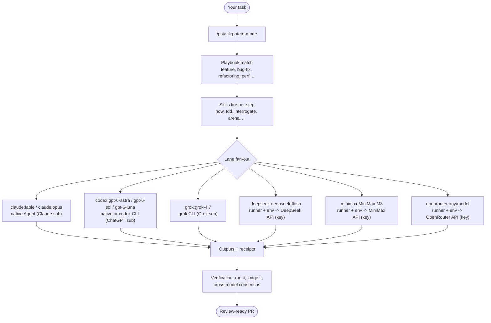
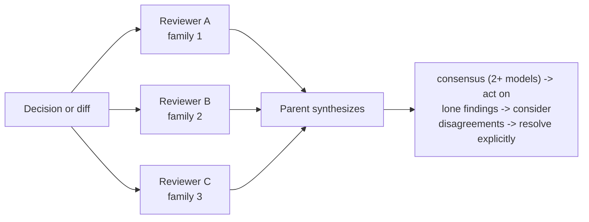
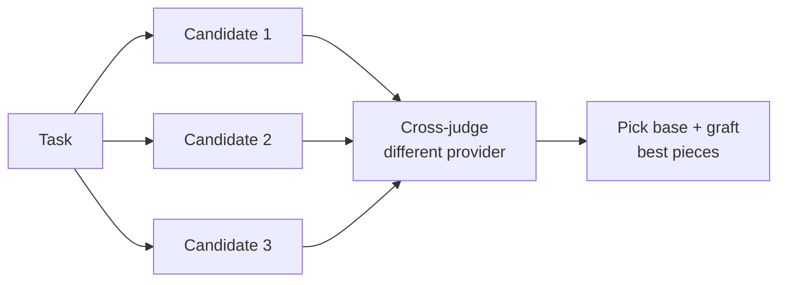
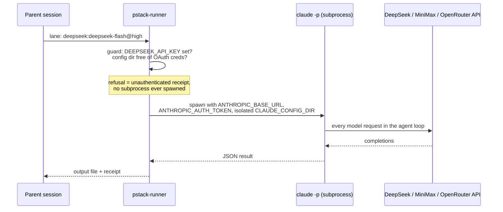

# Using pstack-flex

The walkthrough: what this plugin is, how work flows through it, how to set it up on the models you actually have, and copy-paste examples for the skills you will use daily. Lane mechanics and pricing live in [LANES.md](LANES.md); the fork's delta over upstream is in [UPSTREAM-FLEX.md](../UPSTREAM-FLEX.md).

## What this is

pstack is a plugin of engineering skills, playbooks, and small local tools for coding agents — not a model, not a service. You hand `poteto-mode` a task; it matches the task to a playbook, works the steps, and leaves evidence (diffs, runs, receipts) you can inspect instead of asking for trust. Its sharpest edge is multi-model adversarial review: several different model families challenge important work, because the adversarial signal comes from model diversity, not assigned personas.

pstack-flex adds one thing on top: **you choose the models and the compute**. Any subset of families works, and two open labs — DeepSeek and MiniMax — are first-class lanes on plain API keys, down to a zero-subscription setup. With one OpenRouter key, a role can use any model in OpenRouter's catalog.

If you also use my [thisguyskills](https://github.com/thisguymartin/skills) collection: that repo decides **what** to build (shaping, spec, Linear, handoff) and its handoff ends with "Use `pstack:poteto-mode`" — which is exactly where this repo picks up.

## The big picture



Every lane is a real agent process with tools and file access. The parent harness (your Claude Code or Codex session) resolves the route once; children never pick their own models.

## Install

The marketplace is named `pstack-flex` and carries the `pstack` plugin. If you have Eric Litman's open-pstack installed, remove it first: both ship a plugin named `pstack`, so their skills would share the `pstack:` names.

Claude Code:

```text
/plugin marketplace add thisguymartin/pstack-flex
/plugin install pstack@pstack-flex
/reload-plugins
```

Codex:

```shell
codex plugin marketplace add thisguymartin/pstack-flex --ref main
codex plugin add pstack@pstack-flex
```

Plus [Bun](https://bun.sh) for the lane runner, and `multi_agent = true` under `[features]` in `~/.codex/config.toml` if Codex is your parent. Sign in only to the CLIs whose subscriptions you actually have — missing families are fine now.

## Keys for the gateway lanes

DeepSeek, MiniMax, and OpenRouter have no login flow here; their lanes read an API key from your environment at spawn time. The runner never writes keys to disk or receipts, so the only question is how the env gets populated. Don't paste keys into `.zshrc` — store them encrypted and load on demand. macOS Keychain, built in and free:

```zsh
# once: store each key (prompts for the value, nothing in shell history)
security add-generic-password -a "$USER" -s pstack-deepseek -w
security add-generic-password -a "$USER" -s pstack-minimax -w
security add-generic-password -a "$USER" -s pstack-openrouter -w

# in .zshrc: a function, not an export — keys enter env only when you call it
pstack-keys() {
  export DEEPSEEK_API_KEY=$(security find-generic-password -a "$USER" -s pstack-deepseek -w)
  export MINIMAX_API_KEY=$(security find-generic-password -a "$USER" -s pstack-minimax -w)
  export OPENROUTER_API_KEY=$(security find-generic-password -a "$USER" -s pstack-openrouter -w)
}
```

Daily flow: `pstack-keys -> claude -> /pstack:poteto-mode`. Alternatives, the threat model, and the spend-cap advice are in [LANES.md](LANES.md#storing-keys). Set spend caps on each provider dashboard (on OpenRouter, a credit limit on the key); that is the real blast-radius control.

## First-time setup: /setup-pstack

```text
/pstack:setup-pstack
```

(Codex: `Use pstack:setup-pstack to configure pstack.`)

Setup is assignment-first: pick which roles run on which families, answer one effort question per **assigned** family, and only assigned families get probed. Unassigned families are skipped, not errors. Every probe is a real one-turn run — a failed probe writes nothing. Three configurations that make sense:

**A. Full frontier** (Claude + ChatGPT + Grok subs) — accept the defaults. GPT-6 Sol writes code, Luna explores and verifies, and the panel spans three providers:

```text
feature, refactoring: codex:gpt-6-sol@high
bug-fix: codex:gpt-6-sol@high
how explorer: codex:gpt-6-luna@high
swarm workers: codex:gpt-6-luna@high
arena runners: claude:fable@max, codex:gpt-6-astra@high, grok:grok-4.7@xhigh, claude:opus@max
```

**B. Hybrid saver** (Claude sub + two API keys) — frontier judgment, cheap volume:

```text
feature, refactoring: deepseek:deepseek-flash@high
bug-fix: deepseek:deepseek-flash@high
judgment and prose: claude:fable@max
hardest tasks: claude:fable@max
swarm workers: deepseek:deepseek-flash@high
arena runners: claude:fable@max, deepseek:deepseek-flash@high, minimax:MiniMax-M3@high
interrogate reviewers: claude:fable@max, deepseek:deepseek-flash@high, minimax:MiniMax-M3@high
```

**C. Zero-subscription budget duo** (nothing but two keys) — start your parent session env-pointed at DeepSeek (walkthrough in [LANES.md](LANES.md#zero-subscription-walkthrough)), then assign everything across the two flex families:

```text
arena runners: deepseek:deepseek-flash@high, minimax:MiniMax-M3@high
interrogate reviewers: deepseek:deepseek-flash@high, minimax:MiniMax-M3@high
```

Two labs are two distinct families, so panels keep real diversity without any override. A single-provider panel needs your explicit confirmation — by design.

## Daily driving: the skills, with examples

**poteto-mode** — the default entry point for any real task. pstack runs only when you ask for it, so start it by name. Once started, it stays sticky across turns and pairs well with long autonomous sessions.

```text
/pstack:poteto-mode

Take ENG-142: saved reports lose their date-range filter after rename.
Repro is in the issue. Fix it, prove it in the running app, and prep the PR.
```

**interrogate** — multi-model review of a decision, design, or diff. Reviewers come from different families; the parent sorts their findings.

```text
/pstack:interrogate

Review this migration plan in docs/plans/report-store.md. Attack the
premise, the rollout order, and anything that loses data on rollback.
```



**arena** — N parallel attempts at the same task, an independent cross-judge, then graft the best parts onto a base.

```text
/pstack:arena

Implement the rate limiter from the spec in docs/spec.md. Run the
configured arena panel and keep the winner's tests regardless of base.
```



**swarm** — same-shaped work fanned across N workers, one combined report. Good for sweeps: "apply this codemod across packages," "audit every endpoint for X."

```text
/pstack:swarm

Audit every handler under src/api/ for missing input validation.
One worker per file group, combined findings ranked by severity.
```

**architect** — competing designs from different families, scored by a judge on yet another family, before any code.

```text
/pstack:architect

Design the offline sync layer: local-first edits, conflict policy,
and migration from the current always-online store.
```

Worth knowing by name: `how` (explain how something works before touching it), `why` (root-cause an incident with your MCP context), `tdd`, `unslop` (de-slop prose and code), `fix-ci`, `babysit` (drive a PR to green). The 23 `principle-*` leaves are loaded by poteto-mode as needed — you rarely invoke them directly.

## What actually happens on a gateway lane

No new harness. The same runner that launches Codex and Grok lanes spawns the stock `claude` binary with swapped environment:



The guard order matters: key check and OAuth check happen in-process **before** anything runs, so a claude.ai login can never be pointed at a third-party endpoint. Inherited `ANTHROPIC_*` values from your parent session are stripped before injection.

## Reading receipts

Every external lane writes a JSON receipt next to its output. The fields that matter:

| Field | Meaning |
| --- | --- |
| `status` | `complete`, or a named dropout (`unauthenticated`, `unavailable-cli`, `timed-out`, ...) |
| `modelVerified` + `modelEvidence` | `provider-report` = the endpoint echoed the requested model (case-insensitive for gateways). `pinned-argv` = it didn't, but the argv pinned it — normal for Codex and sometimes gateways |
| `usage` | real token counts — trust these |
| `costUsd` | real for claude/grok subscription lanes; **always `null` on gateway lanes** (the CLI would price at Anthropic rates). Multiply `usage` by the [LANES.md](LANES.md) table instead |

## Watching your agents

The agent monitor moved to its own plugin, [psf-monitor](https://github.com/thisguymartin/psf-monitor). It draws each pstack session, the agents it spawned, and the external lanes pstack launched as a live graph, and can cancel a running lane.

pstack's side is the lane journal. While `~/.pstack-flex/lanes/` exists, `pstack-runner` records each external lane's start, its output as it streams, and a copy of its receipt there. psf-monitor creates that directory when it starts. Delete the directory to stop journaling. A journal failure never changes a lane's receipt, exit status, or output.

## Cost playbook

- High-volume code-writing roles (`feature`, `bug-fix`, `swarm workers`) -> `deepseek:deepseek-flash` — cheapest tokens, near-free cache hits, and half price in the off-peak window.
- Long-context research and big-repo reading -> `minimax:MiniMax-M3` — 1M context.
- `judgment and prose` and `hardest tasks` -> your best frontier lane if you have one; this is the last role to economize.
- Panels: one frontier + two flex lanes gets you three-family diversity at a fraction of three subscriptions.

## Troubleshooting

| Symptom | Meaning | Fix |
| --- | --- | --- |
| Receipt `unauthenticated`, exit 77, "KEY is not set" | lane env missing | run your `pstack-keys` function (or export the key) in the shell that starts the parent |
| Receipt `unauthenticated`, "OAuth credentials found" | a claude.ai login sits in the lane's config dir | that's the leak guard working; remove the login from `~/.pstack-flex/<provider>` — never `claude login` there |
| Receipt `unauthenticated` after the model ran | the endpoint rejected the key (401) | check the key and the base URL against the provider's current guide |
| Exit 69 `unavailable-cli` | the `claude` binary isn't on PATH for the runner | install it or fix PATH |
| A panel ran with fewer lanes than configured | a lane dropped out with a named receipt | read that receipt; pstack proceeds N-1 and never silently substitutes a model |
| Everything gateway broke after a claude CLI update | Anthropic doesn't support third-party endpoints; compatibility can shift | pin the CLI version on machines that depend on gateway lanes; see [LANES.md](LANES.md#safety-and-policy) |

## The GPT-6 Codex models

`astra` (`codex:gpt-6-astra@high`), `sol-6` (`codex:gpt-6-sol@high`), and `luna` (`codex:gpt-6-luna@high`) are stock families and the first-run defaults: Astra on every panel, GPT-6 Sol on the solo code-writing roles, Luna on exploration and swarm work. They need only your Codex login. Each gets its own effort question and live probe. See [GPT-6 Codex families](LANES.md#gpt-6-codex-families).

A sheet written before this release keeps its assignments. To move a role, run `/setup-pstack` and name it; every role you do not change keeps its descriptor, and `codex:gpt-5.6-sol` stays selectable. For example, this row keeps GPT-5.6 Sol on bug fixes while the rest of the sheet takes the new defaults:

```text
bug-fix: codex:gpt-5.6-sol@max
```

## Selecting the additional gateway models

Run `/setup-pstack` and assign `deepseek-pro` (`deepseek:deepseek-v4-pro@high`) or `minimax-preview` (`minimax:MiniMax-M3.1-Flash-Preview@high`) to named roles. Existing `deepseek` and `minimax` choices remain available. Each model has its own effort selection and live probe. MiniMax preview requires an eligible Token Plan key in `MINIMAX_API_KEY`; see [model choices and thinking controls](LANES.md#multiple-models-per-provider). No existing assignment changes until setup succeeds and you confirm the rendered sheet.

## Using any model through OpenRouter

Export `OPENROUTER_API_KEY`, run `/setup-pstack`, and give a role any model ID from [OpenRouter's catalog](https://openrouter.ai/models), written with its namespace:

```text
interrogate reviewers: claude:fable@max, openrouter:moonshotai/kimi-k3@high, openrouter:z-ai/glm-5.3@high
```

There is no list to pick from. Setup probes the exact model you name, with a marker the model has to read from a file, and writes nothing if the probe fails. The only refused IDs are OpenRouter's own routers (`openrouter/auto`, `openrouter/free`), because they choose the model for you. Panel diversity counts the lab behind the model, so the sheet above spans three providers. Turn off data collection on OpenRouter's privacy settings, or require zero-data-retention hosts, before sending real code. See [LANES.md](LANES.md#openrouter-any-model-one-key).
